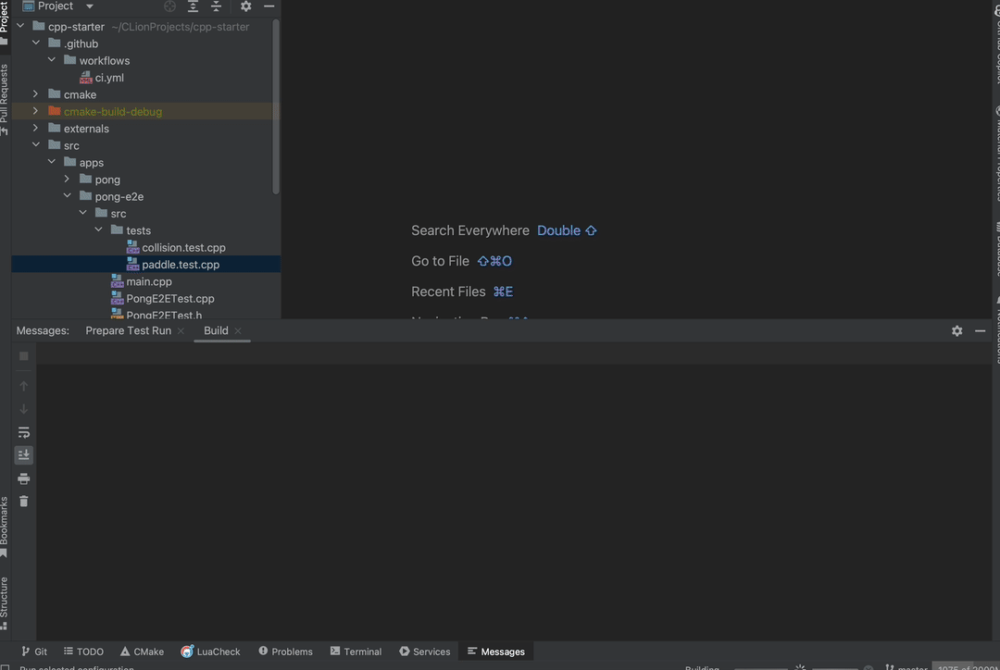

# CPP Starter


## Overview

The cpp-starter project is designed as a starting point for creating C++ applications.

It leverages SDL2 for graphical rendering and input handling and provides a modular architecture for
scalable development.

## Running the Project on Mac

1) Install dependencies:

```bash
$ brew install cmake ninja sdl2 sdl2_ttf sdl2_image sdl2_mixer
```

2) Build:

```bash
$ cmake -DCMAKE_BUILD_TYPE=Debug -DCMAKE_MAKE_PROGRAM=$(brew --prefix)/bin/ninja -G Ninja -S . -B build
$ cd build
$ ninja
$ ctest
```

3) Run:

```bash
$  cd build/src/apps/pong
$ ./AppPong 
```

## Project Structure

The project is structured into various directories, each serving a specific purpose:

- `src`: The main source directory.
    - `apps`: Contains individual applications. Example: `pong`.
    - `packages`: Contains shared libraries or modules. Examples: `core`, `ecs`, `events`.

### App Structure

- Each app, like `pong`, contains its source code, assets, and CMake configurations.
- Structure inside an app:
    - `src`: Source files for the application.
    - `assets`: Game assets like fonts and images.

### Package Structure

- Shared functionalities are grouped into packages under `packages`.
- Examples include `core` for core functionalities, `ecs` for entity-component systems.

## Creating New Apps and Packages

### Apps

1. To create a new app, add a directory under `src/apps`.
2. Include a `CMakeLists.txt` in your app directory for build configurations.
3. Organize your app's source code, assets, and tests within this directory.
4. Include new app in the src `CMakeLists.txt`.

Example:

```cmake
set(APP_NAME AppPong)
set(APP_FOLDER_NAME pong)

set(SOURCES
        src/main.cpp
        src/entities/GameObject.h
        src/strategies/MinimalLoopStrategy.h
        )

add_executable(${APP_NAME} ${SOURCES})

# Copy assets
file(COPY assets DESTINATION ${CMAKE_BINARY_DIR}/src/apps/${APP_FOLDER_NAME})

target_link_libraries(${APP_NAME} Core)
```

### Packages

1. Create a new package under `packages` for shared functionalities.
2. Each package should have its own `CMakeLists.txt`.
3. Include the package in src `CMakeLists.txt`.

## Writing Tests

- Tests are written using GoogleTest and GoogleMock.
- Each app or package should contain its test files, e.g., `GameObject.test.cpp`.
- Use `add_test` in `CMakeLists.txt` to include tests in the build process.

If you want to include tests for your app, add the following to your `CMakeLists.txt`:

```cmake
set(APP_NAME_TEST ${LIB_NAME}Test)

add_test(AllTests${LIB_NAME} ${APP_NAME_TEST})

set(SOURCES_TEST
        src/entities/GameObject.h
        src/strategies/MinimalLoopStrategy.h
        src/entities/GameObject.test.cpp
        src/strategies/MinimalLoopStrategy.test.cpp)

add_executable(${APP_NAME_TEST} ${SOURCES_TEST})

target_link_libraries(${APP_NAME_TEST} PRIVATE
        gtest
        gmock
        gmock_main
        Core
        SDL2::SDL2
        )
```


